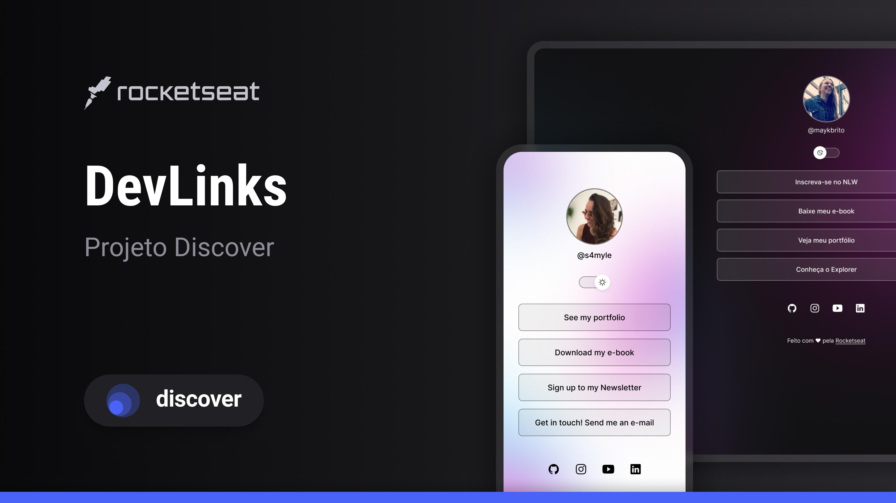

<h1 align="center"> DevLinks </h1>

  	<a href="#-Project">Project</a>&nbsp;&nbsp; | &nbsp;&nbsp;
	  <a href="#-Tools">Tools</a>&nbsp;&nbsp; | &nbsp;&nbsp;
  	<a href="#-Layout">Layout</a>

  

 

  

 

## 💻 Project

DevLinks is a link aggregator. It allows you to display multiple links on your social media bio. You can use this application to showcase your online presence and connect with your audience on different platforms.

Access my project <a href="https://samylecarvalho.github.io/link-anchor" target="_blank" >HERE</a>.
 

## :wrench: Tools

This project has been developed using the following:

- HTML e CSS
- JavaScript
- Git/Github
- Figma

 

## 🔖 Layout

You can get the layout of the original project <a href="https://www.figma.com/community/file/1187422022288947321" target="_blank" > HERE.</a> 
You need to set up a <a href="https://figma.com" target="_blank"> Figma </a> account to access it.

> Projeto Discover is a a free and exclusive program offered by <a href="https://www.rocketseat.com.br" target="_blank">Rocketseat</a> . You can do it yourself by completing their fun and well structured program in video format <a href="https://lp.rocketseat.com.br/devlinks/inscricao?utm_source=github&utm_medium=descricao&utm_campaign=capture-devlinks&utm_term=organic&utm_content=descricao-github-mayk-brito" target="_blank">here</a>.

---

Made with ♥ by Rocketseat :wave: [Join our community on Discord](https://discord.gg/rocketseat)!
